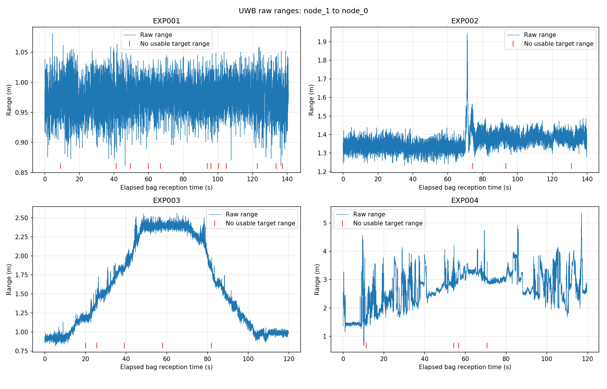
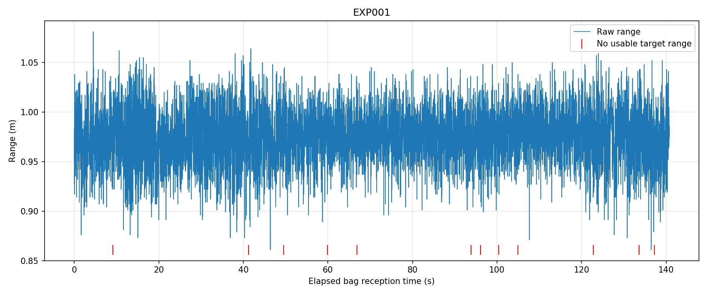
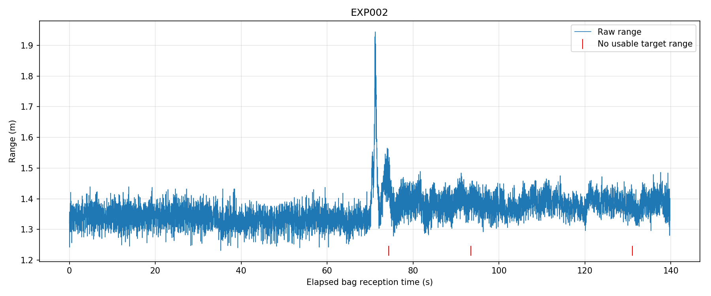
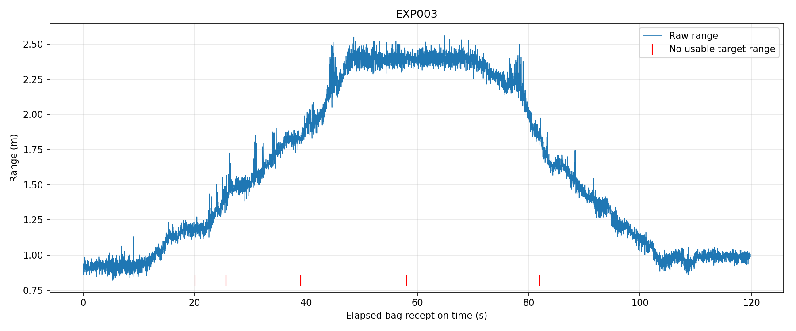
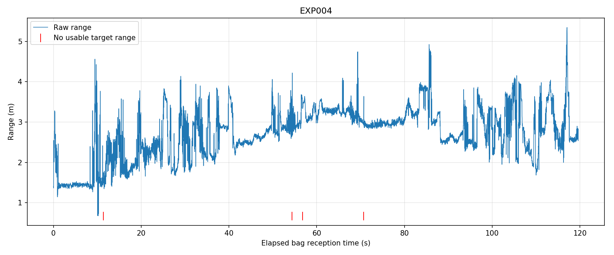

# 2026-09-20 EXP001–004 初步现场实验分析产物

本目录保存 EXP001–004 的精选分析图、机器可读统计摘要和原始
rosbag SHA256 清单。完整实验记录见：

- [`../2026-09-20_EXP001_car1_static_LOS.md`](../2026-09-20_EXP001_car1_static_LOS.md)
- [`../2026-09-20_EXP002_car1_static_human_NLOS.md`](../2026-09-20_EXP002_car1_static_human_NLOS.md)
- [`../2026-09-20_EXP003_car1_manual_push_LOS.md`](../2026-09-20_EXP003_car1_manual_push_LOS.md)
- [`../2026-09-20_EXP004_car1_manual_push_human_NLOS.md`](../2026-09-20_EXP004_car1_manual_push_human_NLOS.md)
- [`../2026-09-20_EXP001_004_comparison.md`](../2026-09-20_EXP001_004_comparison.md)

## 数据管理

- 原始 `.bag` 文件不提交进 Git 历史。
- `results/SHA256SUMS.txt` 记录四份原始 bag 的完整性校验值。
- 图表和摘要由仓库内的离线分析脚本生成。
- 逐帧 CSV 可以从原始 bag 重建，因此不提交。
- 分析没有进行静默偏置修正、滤波或异常点删除。

## 主要统计

| 实验 | 场景 | 总帧数 | 可用率 | 均值 (m) | 中位数 (m) | 标准差 (m) | 最小–最大 (m) |
|---|---|---:|---:|---:|---:|---:|---:|
| EXP001 | 静态 LOS | 7039 | 99.830% | 0.9748 | 0.9750 | 0.0288 | 0.861–1.081 |
| EXP002 | 静态人体 NLOS | 6990 | 99.957% | 1.3636 | 1.3600 | 0.0486 | 1.231–1.944 |
| EXP003 | 人工推动 LOS | 5991 | 99.900% | 1.6052 | 1.5030 | 0.5647 | 0.822–2.560 |
| EXP004 | 人工推动人体 NLOS | 5981 | 99.933% | 2.7160 | 2.8110 | 0.6440 | 0.675–5.344 |

四组消息频率均约为 50 Hz，统计对象为 `node_1` 对 `node_0`
的距离观测。

## 图表

### 四组实验总体对比

| EXP001 静态 LOS | EXP002 静态人体 NLOS |
|---|---|
|  |  |

| EXP003 人工推动 LOS | EXP004 人工推动人体 NLOS |
|---|---|
|  |  |

## 初步结论

1. EXP001 静态 LOS 输出集中，标准差约为 2.9 cm。
2. EXP002 相比 EXP001 的均值增加约 0.3888 m，表明本次人体遮挡
   产生了明显的正向距离偏移。
3. EXP003 能反映人工推动时推远、停留和返回的距离变化趋势。
4. EXP004 在动态人体遮挡下波动和长尾明显增大，最大观测达到
   5.344 m，可作为动态 NLOS 压力测试。
5. 四组可用率均高于 99.8%，表明消息输出连续；高可用率不等同于
   距离观测具有同等精度。

## 解释限制

- EXP001 和 EXP002 没有独立卷尺真值，不能把均值解释为绝对误差。
- 0.3888 m 只是在本次布置下观察到的相对变化，不是通用补偿常数。
- EXP003 与 EXP004 的人工推动轨迹没有严格复现，不能逐时刻比较。
- `quality` 为 `NaN`，不能作为本轮信号质量指标。
- 分析使用 rosbag 接收时间，消息头时间只作为诊断信息。

## 结果文件

- `results/summary.csv`：四组实验的紧凑统计表。
- `results/summary.json`：机器可读的完整统计结果。
- `results/SHA256SUMS.txt`：四份原始 bag 的 SHA256。

分析脚本：

- `ros_ws/src/uwb_coop_localization/scripts/analyze_uwb_bags.py`

这些产物用于初步链路验证和后续实验设计，不表示已经完成二维协同
定位或多传感器融合。
