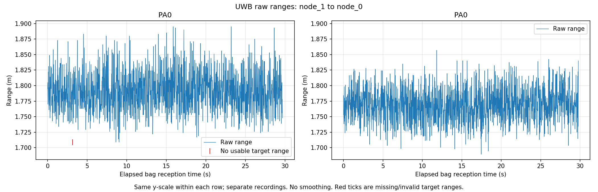
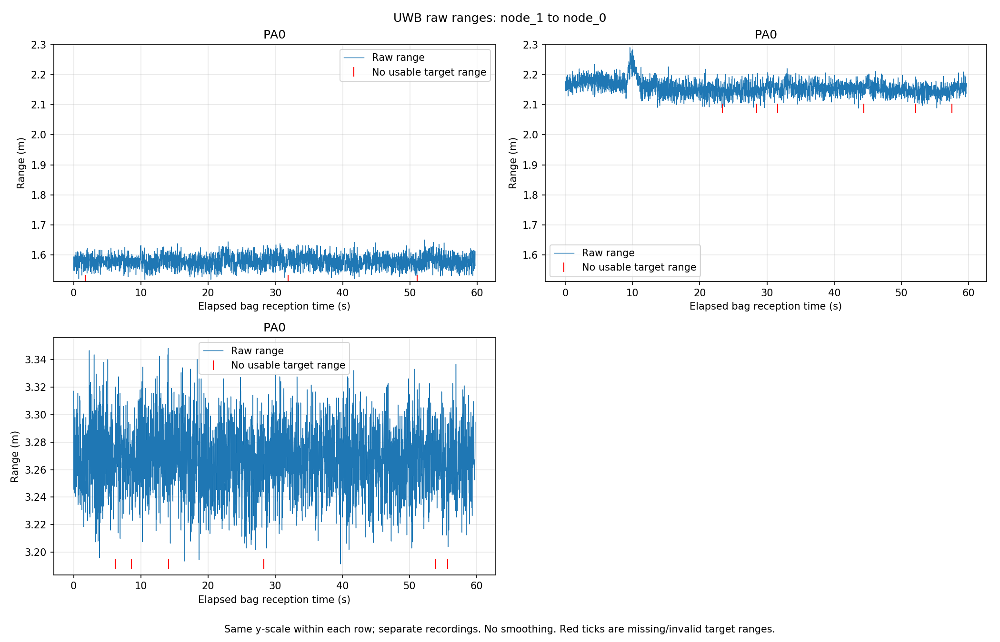
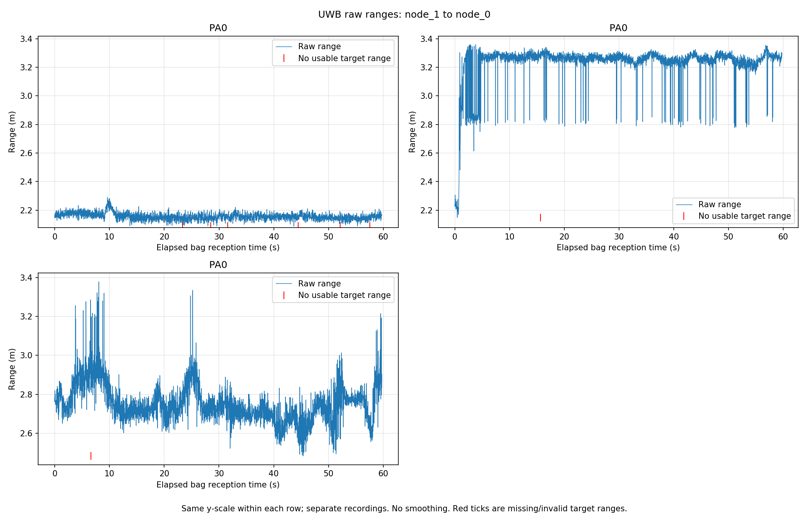
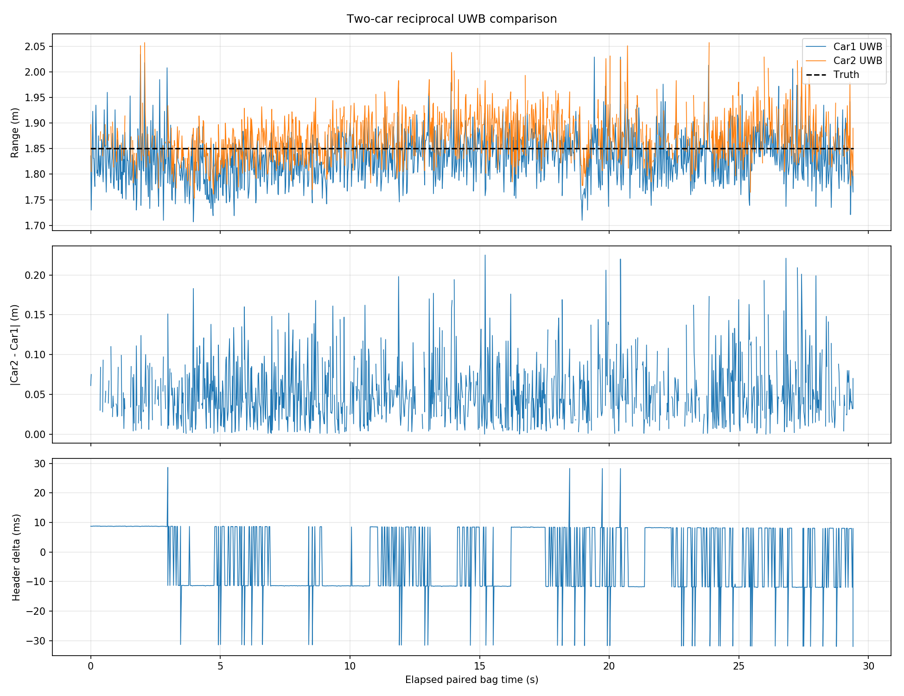
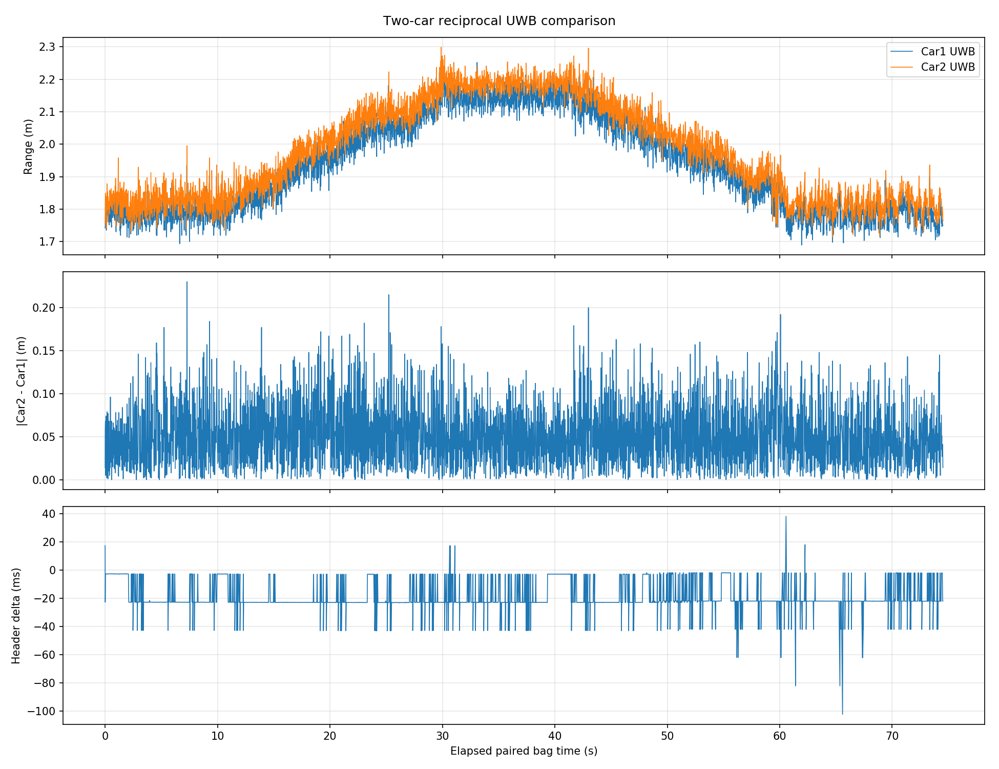
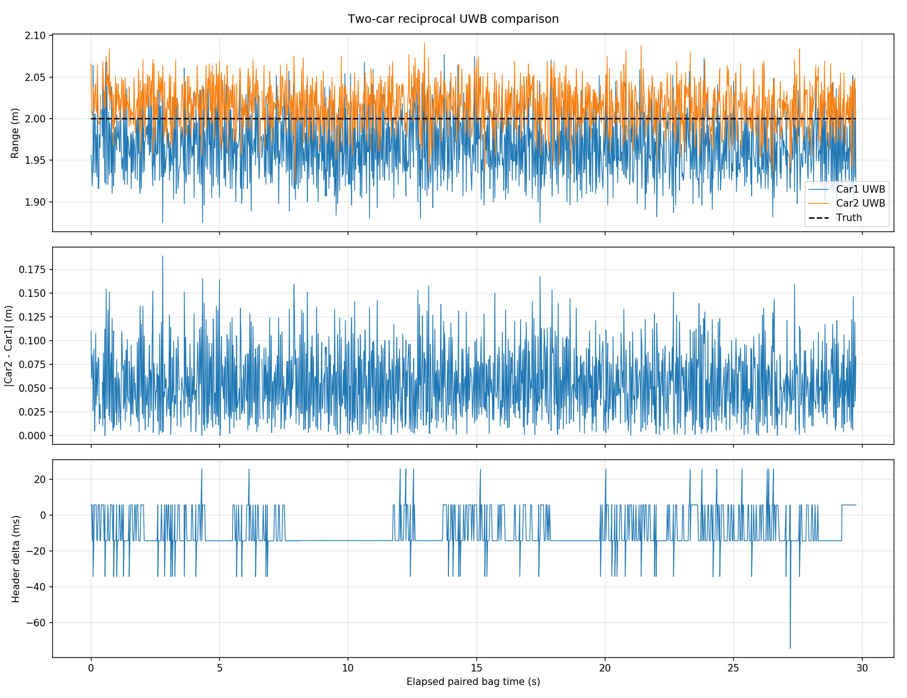
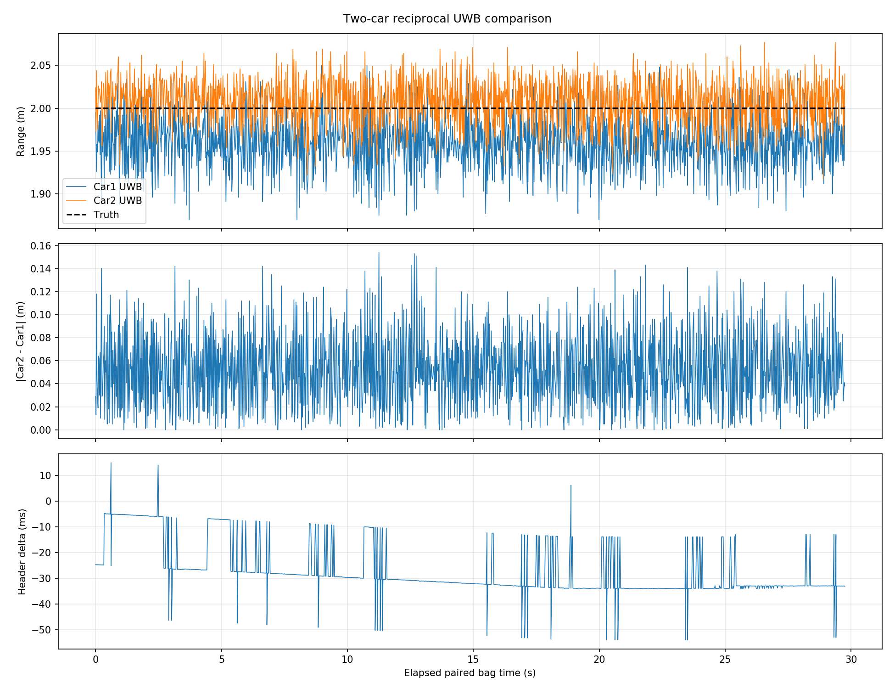

# 2026-09-27 现场实验分析产物

本目录保存 2026-09-27 现场实验的精选分析图、机器可读摘要和 rosbag SHA256 清单。完整实验条件、指标解释和局限见 [`../20260927_FIELD_TEST_SUMMARY.md`](../20260927_FIELD_TEST_SUMMARY.md)。

## 数据管理原则

- 原始 `.bag` 文件保存在现场数据存储中，不提交 Git。
- `results/SHA256SUMS.txt` 用于核验 18 份原始 bag。
- 图表和摘要由仓库内的离线分析脚本生成，不对原始距离进行静默修正或过滤。
- 逐帧 CSV 和 `paired_measurements.csv` 可由 bag 重建，因此不提交。

## 精选图表

### 单链路重复节点聚合前后

### 单链路 1.5 m、2.0 m 和 3.0 m LOS 卷尺真值

### 单链路 2.0 m LOS 与人体 NLOS

### 双车静态 LOS，真值 1.85 m

### 双车人工推动动态往返

### EXP006 姿态敏感性 Pilot

| 正面对准 | Car1 顺时针旋转 90° |
|---|---|
|  |  |

## 结果文件

- `results/single_link_*_summary.csv`：单链路对比的紧凑表格。
- `results/*_summary.json`：机器可读统计结果。
- `results/SHA256SUMS.txt`：原始 bag 文件名及 SHA256。

分析脚本：

- `ros_ws/src/uwb_coop_localization/scripts/analyze_uwb_bags.py`
- `ros_ws/src/uwb_coop_localization/scripts/analyze_two_car_bag.py`

这些产物用于实验记录和初步汇报，不表示已经完成二维协同定位或 UWB/Odom/IMU 状态融合。
